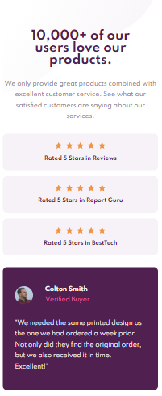
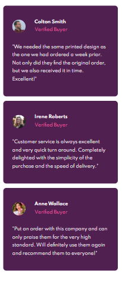
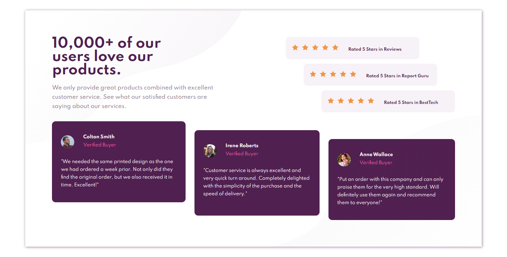

# Frontend Mentor - Social proof section solution

This is a solution to the [Social proof section challenge on Frontend Mentor](https://www.frontendmentor.io/challenges/social-proof-section-6e0qTv_bA).

## Table of contents

- [Overview](#overview)
  - [The challenge](#the-challenge)
  - [Screenshot](#screenshot)
  - [Links](#links)
- [My process](#my-process)
  - [Built with](#built-with)
  - [What I learned](#what-i-learned)

**Note: Delete this note and update the table of contents based on what sections you keep.**

## Overview

### The challenge

Users should be able to:

- View the optimal layout for the section depending on their device's screen size (mobile: 415px, desktop: 1300px)

### Screenshot

### Links

- [Frontend Mentor](https://www.frontendmentor.io)
- [Challenge](https://www.frontendmentor.io/challenges/social-proof-section-6e0qTv_bA)

## My process

### Built with

- Semantic HTML5 markup
- Sass
- Flexbox
- CSS Grid
- Pseudoelements
- Mobile-first workflow

### What I learned

Practice Sass syntax, pseudoelements, Flexbox and Grid for layout.
Also mobile-first is awesome!
